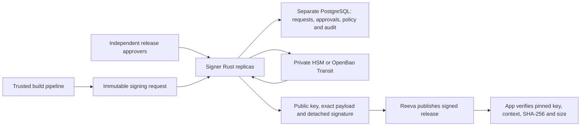

# Rust signer for Reeva on private cloud

Design researched on 2026-10-08. A Rust/OpenBao implementation now exists in
`signer/` and Docker Compose; see [runtime operations](signer-operations.md) for
the implemented scope and limits. HSM adapters, FROST, independent-host HA, and
TUF remain design options. This supplements [private key security research](private-key-security.md).

## Scope

Build a narrow release-signing service, `reeva-signer`, in Rust. It replaces the
signing functionality needed from a cloud KMS, without requiring AWS. It does
not claim to reproduce AWS KMS's hardware boundary, certifications, or complete
key-management feature set.

Distinguish three goals:

- **Availability:** several service replicas survive a machine failure.
- **Key custody:** an HSM keeps key material outside application memory;
  software-only storage cannot offer the same protection against host compromise.
- **Distributed authorization:** threshold signing prevents one compromised
  signing participant from issuing a signature by itself.

Replicating a complete private key onto several Rust nodes provides availability,
but increases the number of places an attacker can steal or misuse it. Raft
consensus does not turn replication into cryptographic threshold protection.

## Recommended first implementation

- Run at least two Rust API replicas on different hosts, behind an internal
  load balancer. The metadata database and signing backend need their own HA;
  API replicas alone do not remove these dependencies. Use a separate database,
  credentials, network rules, and administrative boundary from Reeva.
- Rust owns release policy, approvals, request validation, idempotency, and
  provider adapters. Key custody belongs to an existing HSM or OpenBao, rather
  than a newly written key vault.
- Reeva may request signing or receive completed signatures, but cannot approve
  its own requests, change signer policy, or directly access the custody backend.
  Signer replicas enforce the same policy regardless of which receives a request.
- Start with PostgreSQL transactions for request state. Do not introduce a custom
  Raft cluster when the existing database can supply the necessary consistency.
  A self-contained distributed database would be a separate project scope.

## Key backend choices

### Hardware available: PKCS#11 HSM

Generate one key per software product in the HSM with sensitive, non-extractable
private-key attributes. Validate actual device behavior, permissions, supported
mechanisms, and vendor backup/HA procedures. Standard PKCS#11 attributes are not
a substitute for verifying the hardware implementation.

Rust can use the `cryptoki` PKCS#11 wrapper. Its guarantees depend on the
underlying provider's conformance. Require the hardware to support **pure
Ed25519 over the exact message bytes**, not merely another curve or Ed25519ph.
If it does not, a different versioned client algorithm contract is needed.
[cryptoki documentation](https://docs.rs/cryptoki/latest/cryptoki/).

An HSM prevents ordinary extraction of private material. A compromised Rust
signer with permission to use the HSM can still request malicious signatures.
For resistance to that failure, authorization must also be enforced outside the
compromised process, or use independent threshold participants.

### VM-only: OpenBao Transit

OpenBao Transit supports Ed25519 signing and key versions. Create independent
product keys with `derived=false`, `exportable=false`, and
`allow_plaintext_backup=false`. Give the Rust workload access to the necessary
signing paths only; deny export, configuration changes, key creation, deletion,
and administration to its runtime identity. Pin the selected key version.
Do not auto-rotate OTA keys before the client trust transition is ready.
[OpenBao Transit API](https://openbao.org/docs/api/secret/transit/).

Use an existing operated HA OpenBao deployment, or provision one on separate
hosts. Raft is one supported HA storage option; PostgreSQL is another. A
three-voter Raft deployment tolerates one unavailable voter when the remaining
majority can communicate. Test actual failover and snapshot restoration.
[OpenBao Raft configuration](https://openbao.org/docs/configuration/storage/raft/),
[storage options](https://openbao.org/docs/configuration/storage/).

Keep unseal shares with separate custodians and outside container environment
files. Manual unseal requires operators after restarts; unattended auto-unseal
needs another protected root of trust. Putting the decryption key next to the
encrypted data defeats the intended separation. OpenBao's Shamir unseal quorum
controls opening the vault; it is **not** a quorum for each Ed25519 signing
operation. A software-only unsealed vault still has usable key material in its
process, so host/process compromise remains a key-custody risk.
[OpenBao seal/unseal](https://openbao.org/docs/concepts/seal/).

Do not add automatic plaintext PEM fallback when OpenBao/HSM is unavailable.
Previously signed releases remain available from Reeva; new signing fails closed.

## Rust stack and API boundary

Suggested implementation tools, subject to version pinning and dependency review:

| Component | Choice | Responsibility |
| --- | --- | --- |
| HTTP and async runtime | Axum, Tokio, Tower | Internal API, request limits, deadlines, bounded concurrency |
| TLS | rustls with explicitly configured client certificate verification | Workload mTLS; validate identities, not only certificate presence |
| State | PostgreSQL and SQLx | Durable requests, unique identities, approvals, policy revisions, leases |
| Cryptography | ed25519-dalek, SHA-256 implementation | Independent verification and test vectors; no production private key custody in API replicas |
| HSM adapter | cryptoki | PKCS#11 provider session management |
| Transit adapter | Typed HTTPS client | Restricted OpenBao signing requests, response/version validation |
| Operations | tracing and metrics | Redacted logs, health/readiness, audit delivery and shutdown |

Axum uses Tokio/Hyper. `ed25519-dalek` provides Ed25519 verification and optional
zeroization of software signing keys; zeroization cannot protect a live process
from privileged access. Rust reduces many memory-safety mistakes but does not
prevent authorization errors or compromised dependencies/native HSM libraries.
[Axum](https://docs.rs/axum/latest/axum/),
[ed25519-dalek](https://docs.rs/ed25519-dalek/latest/ed25519_dalek/).

Expose a release workflow instead of a general endpoint that signs arbitrary
bytes:

- `POST /v1/signing-requests`: submit exact manifest payload, immutable build
  reference, requested product/key version, and idempotency key.
- `POST /v1/signing-requests/{id}/approvals`: independently authorize the exact
  request digest and policy revision; disallow self-approval.
- `GET /v1/signing-requests/{id}`: retrieve status and completed public envelope.
- `GET /v1/products/{id}/keys/{version}/public`: authenticated distribution of
  public metadata; this does not establish client trust by itself.

Key creation, revocation, policy administration, and recovery use a separate
administrative interface and identity. Do not accept caller-controlled key
paths or arbitrary artifact-fetch URLs. Fetch trusted build artifacts using
allowlisted endpoints and independent credentials, with streaming size/time
limits; calculate their hash and size independently.

Request state is `pending -> approved -> signing -> signed`, with explicit
rejected, expired, and failed states. Approvals bind the exact payload digest,
artifact hash, key version, product, approver, expiry, and policy revision.
Changing these creates a new request. Check current key/policy status before
signing and before releasing the result; stopping a key cannot revoke signatures
already released to clients.

Use unique constraints and transaction/CAS claims for concurrent replicas. A
bounded worker pool needs durable leases, retry limits, deadlines, and shutdown
handling. Require durable authorization/audit records before exposing a signature.
Signing and database commits are not one transaction: a crash after the backend
signs can cause another signing call. Do not claim exactly-once HSM operations;
return a stable stored result for the same request and reject an idempotency key
reused with different content.

## Preserve the Reeva client contract

Sign the exact decoded payload bytes as pure Ed25519, returning the current
`{payload, signature, keyId}` envelope. The signature is 64 bytes encoded as
base64url; `keyId` remains SHA-256 of DER SPKI public-key encoding. Validate the
provider signature independently before returning it.

Translate OpenBao's versioned signature wrapper into the detached signature;
do not expose it as though it were Reeva's raw signature. Encode provider public
keys as SPKI using a cryptography library. Map backend key versions to immutable
public-key fingerprints. Respect both Reeva's current payload limit and any
provider limit; do not silently truncate, hash instead of signing raw bytes, or
substitute a different algorithm.

CMS can display/request progress, but publisher approval must use an identity
outside a compromised Reeva session. Clients still need pinned trust, verified
context, size/hash limits, rollback protection, and a recovery path. Neither
mTLS nor a successful server-side signing check replaces client verification.

## Optional next step: true threshold signing

If the requirement is that one compromised signer host cannot authorize an
update, investigate **FROST Ed25519 2-of-3** with three independently operated
participants. Each holds a share; the coordinator assembles a signature without
reconstructing the complete private key. Participants independently validate the
approved message and policy. Running all shares under one hypervisor/root
administrator does not establish independent compromise boundaries.

RFC 9591 defines an Ed25519-compatible FROST ciphersuite; it is an Informational
CFRG RFC, not an IETF Standards Track specification. Rust implementations exist
in the Zcash Foundation FROST project. Choose and review a specific release and
its audit scope before using it; a library audit does not certify this service.
[RFC 9591](https://www.rfc-editor.org/rfc/rfc9591.html),
[Zcash Foundation implementation](https://github.com/ZcashFoundation/frost).

This can potentially preserve a single public key and 64-byte signature at the
client, but interoperability must be proved with Reeva's Node verifier and actual
client implementations. Manage single-use nonces across retries, crashes,
snapshot restores, and concurrent sessions; nonce reuse can expose secret shares.
Use a reviewed distributed key-generation procedure if the complete private key
must never exist; generating a complete key and splitting it does not meet that
requirement. Restore/re-share procedures must preserve threshold security.

FROST does not itself supply TUF's root trust, revocation, or freshness rules.
Keep that client/repository design separate. It also does not automatically make
software shares non-exportable or compatible with conventional HSM APIs.

## Delivery and verification

Implement in stages: provider interoperability proof -> Rust authorization and
durable request flow -> HA deployment/recovery -> Reeva integration -> optional
threshold protocol after review. Keep local Compose useful for development;
several containers on one host are not production HA or independent key custody.

Production acceptance includes cross-language signature vectors; tampering,
wrong-key/product, unauthorized/self-approval, expiry, replay and concurrent
requests; crash after signing/before commit; backend/DB/audit outages; node loss
and network partitions; key revocation/rotation; snapshot restore; credential
renewal and graceful shutdown. Measure request latency and sustained throughput
with the real custody backend. FROST additionally needs adversarial protocol,
nonce lifecycle and participant-compromise review.

See `docs/verification.md` for implementation checks. No HSM, FROST, or
independent-host HA verification has been performed. The bundled custody backend
is software-only OpenBao.
