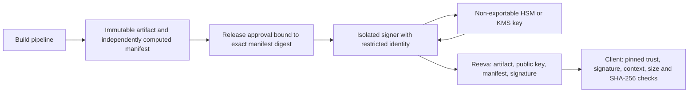

# OTA private key security research

Researched on 2026-10-08. This is a design recommendation, not an implemented
KMS/HSM integration or a security certification.

For a deployment without AWS, see the [Rust private-cloud signer proposal](private-cloud-signer.md).

## Security objective and threat model

Absolute private key security cannot be guaranteed. Protect both the key
material and the authority to issue trusted updates. A non-exportable key can
still sign malicious data if an attacker obtains signing permission.

The recommended objective is that compromise of the Reeva process, its
database, its CMS accounts, or its artifact storage cannot authorize a new
trusted release. This requires a separate signing boundary and clients that
enforce their pinned trust policy. Compromise of the signer, build pipeline,
approval identities, hardware, or client remains a separate risk.

| Mechanism | Protection | Remaining risk |
| --- | --- | --- |
| Encrypted private key in DB, decrypted by Reeva | Reduces exposure of DB backups alone | A compromised runtime with decryption access can obtain or use the key |
| Encrypted PEM on an offline workstation | Reduces theft of a locked disk/file | Unlocking exposes the key to workstation memory; malware can misuse it |
| Key generated inside a non-exportable HSM/KMS signing key | Keeps private material out of application memory and ordinary backups | An authorized attacker can request signatures; provider/hardware and policy administration are trust dependencies |
| Multiple independent signing keys required by the client | One stolen key or signing identity is insufficient when below threshold | A shared administrator, runner, or approval path can defeat the intended independence |

AWS documents that KMS-generated key material remains within its HSM boundary
in plaintext and is not exported through API operations. This applies to the
KMS signing key itself; retrieving a PEM from a secrets manager or using a
returned data key is a different design. [AWS key material protection](https://docs.aws.amazon.com/kms/latest/developerguide/data-protection.html).

## Evidence in the current branch

- Reeva stores public keys and detached signatures. Its verification service
  imports public keys only: `app/services/ota_release_signature_service.ts`.
- `scripts/ota_signing.mjs`, lines 55–62, generates an **unencrypted PKCS8 PEM**
  with POSIX mode `0600`. Lines 89–104 load it into the Node process and sign.
  Permissions restrict other OS users; they do not stop the same user,
  privileged access, malware, or unprotected backups. Directory mode `0700`
  only applies when a directory is newly created.
- The CLI is a file-based signing tool, not a production HSM security boundary.
  Keep its keys off the Reeva host. For production, prefer generating a new
  signing key inside the chosen HSM/KMS and performing an authenticated client
  trust transition. Importing an existing PEM cannot undo earlier exposure.
- The current client contract supports one Ed25519 signature per manifest. It
  does not implement threshold signatures, an offline root role, metadata
  expiration, or emergency client-side revocation. Server-side key revocation
  alone cannot revoke trust in clients if the serving backend is compromised.

## Recommended signing boundary

Recommended controls for Reeva:

1. Generate a separate release signing key per software product inside the
   HSM/KMS. Reeva's runtime has neither private keys nor signing permissions.
   Store public keys and signatures in Reeva; key identifiers are not secrets.
2. Run the signer in a separate account/project or security boundary with
   separate administrators. Permit signing only with the intended product key
   and algorithm. Separate signing, key administration, policy changes, and key
   destruction; administrative access can otherwise grant signing access.
   AWS recommends least privilege for KMS permissions. [AWS IAM guidance](https://docs.aws.amazon.com/kms/latest/developerguide/iam-policies-best-practices.html).
3. Use short-lived workload credentials. Human approvals use strong MFA and
   separate identities. An approval must bind the exact artifact hash and
   complete manifest bytes; modifying either requires another approval.
4. The signer independently computes artifact size/hash and validates product,
   channel, platform, version, and build provenance. It must not blindly sign
   arbitrary payloads supplied by Reeva. A valid signature alone cannot prove
   that a compromised build pipeline produced benign software.
5. Record signing attempts, manifest digests, build identity, approvers, key
   version, and outcomes in logs outside the Reeva administration boundary.
   Alert on unexpected keys, products, sign volume, or policy changes. Restrict
   signer ingress and avoid logging credentials or private material.
6. Maintain tested key-loss and compromise procedures. Disabling the signer
   stops new signatures but does not invalidate signatures already accepted by
   clients. Coordinate client trust updates and protect against key deletion;
   use the provider's supported recovery procedures without exporting keys.

For stronger resilience, adopt TUF with offline root keys and independently
held threshold keys (for example, 2 of 3). Root keys authorize trusted keys and
their replacement; they are not used for every release. Threshold protection
against unauthorized artifact signing also needs to cover the targets role
that authorizes those artifacts. Requiring two UI approvals with one signing
key is an operational control, not a cryptographic threshold. TUF also defines
rollback and freshness defenses. [TUF security principles](https://theupdateframework.io/docs/security/), [TUF roles and metadata](https://theupdateframework.io/docs/metadata/).

One release key can serve many versions, but permanent trust in one
irreplaceable key prevents safe recovery. Clients must reject server-supplied
replacement keys unless authorized by their existing trust policy. Adding a
public key through CMS cannot by itself establish client trust. Public keys
sent by clients do not authenticate those clients.

## Provider and protocol compatibility

| Option | Verified documentation | Consequence for this branch |
| --- | --- | --- |
| AWS KMS | `ECC_NIST_EDWARDS25519` supports `ED25519_SHA_512` with `MessageType:RAW`; `Sign` input is at most 4096 bytes | Candidate for the current Ed25519 protocol when the exact decoded manifest fits 4096 bytes; integration and independent client verification still need testing |
| Google Cloud KMS | `EC_SIGN_ED25519` is listed for SOFTWARE protection, not the HSM table; HSM lists P-256/P-384/secp256k1 algorithms | Cannot claim hardware-backed Ed25519 compatibility; selecting another algorithm requires a versioned client contract |
| Self-managed HSM | Capability depends on the actual device, firmware, mechanism, and SDK | Verify non-exportability, raw Ed25519 support, authentication, backup, availability, and test vectors before selection |

Sources: [AWS key specifications](https://docs.aws.amazon.com/kms/latest/developerguide/symm-asymm-choose-key-spec.html), [AWS Sign API](https://docs.aws.amazon.com/kms/latest/APIReference/API_Sign.html), [Google Cloud algorithms and protection levels](https://docs.cloud.google.com/kms/docs/algorithms).

Reeva currently accepts a base64url payload up to 120,000 characters (roughly
90 KB decoded), including changelog. Therefore AWS KMS is **not a drop-in
replacement for every accepted manifest**. A production adapter must reject
oversized decoded payloads before requesting approval/signing. A future compact
manifest can bind long notes by their hash, but that needs a versioned schema
and coordinated client migration. Do not truncate notes or silently replace
raw Ed25519 with Ed25519ph/digest signing: the signature contract changes.
Confirm algorithm availability in the deployment region and provider account.

## Verification required before production integration

No cloud credentials, production keys, or production data were used for this
research. No HSM/KMS integration, runtime authorization test, migration, or
client implementation was exercised in this research step.

Before enabling a production signer, verify:

- signatures verify with an independent client implementation over exactly the
  same bytes; wrong product/key/hash, tampering, and oversize payloads fail;
- Reeva runtime identities cannot sign, administer keys, or impersonate signer
  identities; key administrators cannot silently bypass the intended approval
  boundary;
- altered artifacts/manifests invalidate approvals; replay and concurrent
  requests follow an explicit idempotency policy;
- signer outage prevents publication of unsigned updates; provider failures do
  not trigger a PEM fallback; already signed releases remain servable;
- compromised-key replacement works for existing clients, including clients
  that missed intermediate releases; logs and recovery survive loss of Reeva;
- a threshold design actually needs independent signatures at the client and
  remains safe after compromise of fewer than the configured threshold keys.

These are acceptance criteria for further implementation, not passing checks.

The subsequent local implementation uses a Rust approval service and OpenBao
Transit in Docker Compose. Its actual checks and software-custody limits are
recorded in [signer operations](signer-operations.md) and
[verification](verification.md); this research section does not establish HSM,
cloud KMS, threshold signing, or client-side enforcement.
